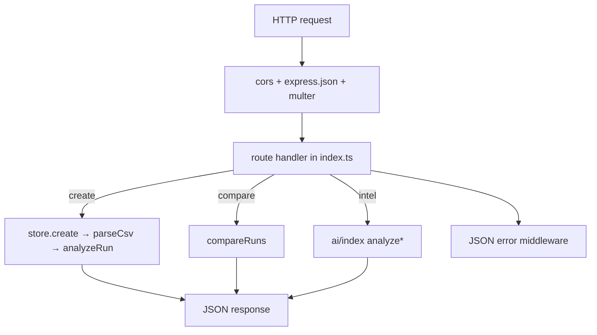

# Server

The server is an Express + TypeScript REST API. It parses thermal test CSVs, runs the analysis pipeline, compares runs against a baseline, manages baseline promotion, and exposes the AI intelligence layer. State is held in memory; there is no database.

## Purpose

Provide a single HTTP surface (`/api/*`) over the domain logic: ingest runs, return analyses, compare candidate vs baseline, promote baselines, and generate regression-intelligence reports. The web app is the only client.

## Directory layout

```
server/
├── src/
│   ├── index.ts            # Express app, all routes, error middleware
│   ├── store.ts            # in-memory run store + baseline state
│   ├── parser.ts           # tolerant CSV → FrameRecord[]
│   ├── types.ts            # shared domain types
│   ├── analysis/
│   │   ├── analyze.ts      # RunSummary + time series
│   │   ├── anomalies.ts    # 7 anomaly detectors
│   │   ├── compare.ts      # baseline-vs-candidate deltas + promotability
│   │   └── stats.ts        # mean, stddev, percentile, round
│   └── ai/
│       ├── index.ts        # analyze* wrappers + provider resolution + fallback
│       ├── provider.ts     # AiProvider / ChatProvider interfaces
│       ├── intelligence.ts # deterministic SRIA core
│       ├── mock.ts         # offline provider (returns core verbatim)
│       ├── llm.ts          # OpenAI/Anthropic/OpenRouter/Ollama chat + LlmProvider
│       ├── prompts.ts      # system prompt, JSON schema, parsers
│       └── config.ts       # runtime AI config (env + Settings overrides)
├── scripts/
│   ├── generate-samples.mjs # synthetic CSV generator (12 scenarios)
│   └── smoke-test.ts        # ad-hoc pipeline check (currently stale)
├── sample-data/            # generated CSVs
├── eslint.config.js        # ESLint 9 flat config
├── .jscpd.json             # duplicate-detection config
└── tsconfig.json           # strict ESM, ES2022, outDir dist/
```

## Key abstractions

| Abstraction | File | Description |
| --- | --- | --- |
| Express app | `server/src/index.ts` | Mounts CORS, JSON body parsing, Multer, routes, and the JSON error middleware |
| `RunStore` | `server/src/store.ts` | `Map`-backed store; `create`, `get`, `list`, `delete`, baseline get/set, `setReport` |
| `parseCsv` | `server/src/parser.ts` | Header-alias-tolerant CSV parser returning `{ frames, warnings }` |
| `analyzeRun` | `server/src/analysis/analyze.ts` | Builds `RunAnalysis` (summary + anomalies + time series) |
| `compareRuns` | `server/src/analysis/compare.ts` | Builds a `ComparisonResult` with deltas, regressions, promotability |
| AI entry points | `server/src/ai/index.ts` | `analyzeRun`, `analyzeComparison`, `analyzePortfolio`, `testConnection` |

## How it works

On startup `server/src/index.ts` builds the Express app, registers routes, and listens on `PORT` (default 4000). Each upload is parsed and analyzed synchronously, then cached on the `StoredRun`. The first run uploaded is auto-seeded as the baseline (`server/src/store.ts`).



### Route groups

| Group | Routes | Notes |
| --- | --- | --- |
| Health | `GET /api/health` | Returns status and active AI provider |
| Settings | `GET/PUT /api/settings`, `POST /api/settings/test` | Runtime AI config; validates `provider` against `VALID_PROVIDERS` |
| Runs | `POST /api/runs`, `POST /api/runs/batch`, `GET /api/runs`, `GET /api/runs/:id`, `DELETE /api/runs/:id` | Single + batch upload; batch continues on per-file errors |
| Run intel | `POST /api/runs/:id/intel` | Generates and caches a per-run report |
| Baseline | `GET/POST /api/baseline`, `POST /api/baseline/promote` | Get/set baseline; gated promotion |
| Compare | `POST /api/compare`, `POST /api/compare/intel`, `POST /api/compare/all`, `POST /api/compare/all/intel` | Pairwise and portfolio comparison, with optional intelligence |

The full request/response contract is documented in [API reference](../api/index.md).

### File uploads

Multer is configured with memory storage and a 50 MB limit (`server/src/index.ts`). Single uploads use `upload.single("file")`; batch uploads use `upload.array("files", 50)`. Multer errors (oversized file, wrong field) are translated to 413/400 JSON by the trailing error middleware so the client always gets `{ error }`.

### State and lifecycle

The `RunStore` keeps a `Map<string, StoredRun>` plus a `baselineId` and lock timestamp. Deleting the baseline clears the baseline. Generated reports are cached back onto the run via `setReport`, so `GET /api/runs/:id` can return a previously computed `aiReport`. Because everything is in memory, restarting the server clears all runs and the baseline. See [Run comparison and baseline promotion](../features/run-comparison-and-baseline-promotion.md).

## Integration points

- **Imports** the domain layer (`analysis/*`, `parser.ts`, `store.ts`) and the AI layer (`ai/index.ts`).
- **Exposes** `/api/*` consumed by the web app's `web/src/api.ts`.
- **Reads** environment variables (via `server/src/ai/config.ts` and `PORT`) and a `.env` file through `dotenv/config`.
- **No outbound calls** except from LLM providers in `server/src/ai/llm.ts` (only when a cloud/Ollama provider is selected).

## Entry points for modification

- To add or change an endpoint, edit `server/src/index.ts` and add a matching method in `web/src/api.ts`.
- To change what a run summary contains, edit `summarize()` in `server/src/analysis/analyze.ts` and the `RunSummary` type in `server/src/types.ts` (and the `METRICS` list in `compare.ts` if it should be compared).
- To add an AI provider, implement it in `server/src/ai/llm.ts`, register it in `server/src/ai/index.ts` and `config.ts`, and add it to `VALID_PROVIDERS` in `index.ts`. See [AI providers](../features/ai-providers.md).
