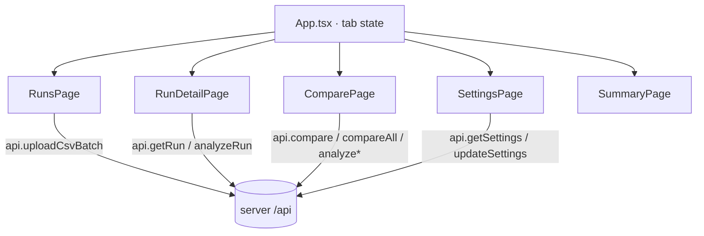

# Web

The web app is a React + Vite single-page dashboard. It uploads runs, visualizes per-run metrics and anomalies, drives pairwise and portfolio comparisons, manages AI settings, and shows an SDLC summary view. All domain logic is on the server; this app is a typed client and presentation layer.

## Purpose

Give analysts an interactive surface over the API: drag-and-drop CSV upload, run detail with charts, comparison with promotion controls, the regression-intelligence reports, and provider configuration.

## Directory layout

```
web/
├── index.html              # Vite entry, mounts #root
├── vite.config.ts          # React plugin + /api proxy → :4000
├── src/
│   ├── main.tsx            # React root render
│   ├── App.tsx             # tab router (Runs/Compare/Settings/Summary)
│   ├── styles.css          # CSS-variable design tokens (dark theme)
│   ├── api.ts              # typed fetch client + mirrored types
│   ├── pages/
│   │   ├── RunsPage.tsx          # upload + run list + baseline controls
│   │   ├── RunDetailPage.tsx     # metrics, anomalies, charts, run report
│   │   ├── ComparePage.tsx       # pairwise + compare-all + portfolio
│   │   ├── SettingsPage.tsx      # AI provider configuration
│   │   └── SummaryPage.tsx       # SDLC "how this was built" view
│   ├── components/
│   │   ├── UploadZone.tsx           # drag/drop multi-file input
│   │   ├── MetricGrid.tsx           # summary metric cards
│   │   ├── AnomalyList.tsx          # anomaly rows
│   │   ├── TimeSeriesCharts.tsx     # Recharts line charts
│   │   ├── IntelligenceReportPanel.tsx  # SRIA report UI
│   │   ├── PortfolioReportPanel.tsx     # portfolio report UI
│   │   ├── intelTheme.ts            # verdict/priority color helpers
│   │   ├── Badge.tsx                # severity badges
│   │   └── Card.tsx                 # generic card
│   └── data/
│       └── sdlc.ts                  # static content for the Summary page
├── eslint.config.js        # ESLint 9 + react-hooks + react-refresh
└── tsconfig.json           # strict, noUnusedLocals/Parameters
```

## Key abstractions

| Abstraction | File | Description |
| --- | --- | --- |
| `App` | `web/src/App.tsx` | State-based tab router; tracks selected run, active provider, and a compare-all trigger |
| `api` | `web/src/api.ts` | Single object with every typed endpoint method |
| `RunsPage` | `web/src/pages/RunsPage.tsx` | Upload zone, run list, set-baseline / delete actions |
| `ComparePage` | `web/src/pages/ComparePage.tsx` | The largest page: pairwise compare, compare-all, promotion, portfolio report |
| `IntelligenceReportPanel` | `web/src/components/IntelligenceReportPanel.tsx` | Renders verdict, behavioral changes, hypotheses, validation steps |
| `SettingsPage` | `web/src/pages/SettingsPage.tsx` | Provider tiles + key/model fields with masked previews |

## How it works

`web/src/main.tsx` renders `App`, which holds the active tab in state and conditionally renders one page. There is no router library; navigation is `setTab(...)`. The header shows the active AI provider, fetched once from `GET /api/health`.



### Upload-and-navigate flow

`RunsPage` uploads via `api.uploadCsvBatch`, refreshes the run list, and reports the total run count up to `App`. `App` only auto-switches to the **Compare** tab once there are at least two runs; with a single first run it stays on **Runs** so more can be added (`web/src/App.tsx`). The `UploadZone` accepts multiple files via drag-drop or file picker (`web/src/components/UploadZone.tsx`).

### Run detail

`RunDetailPage` loads a run, renders the `MetricGrid`, `AnomalyList`, and `TimeSeriesCharts`, and hosts an `IntelligenceReportPanel`. Clicking "Run agent" calls `api.analyzeRun(id)`, which generates and caches the report server-side; the panel renders the verdict, behavioral changes (each with an actionable conclusion), ranked hypotheses, and prioritized validation steps. See [Regression intelligence agent](../features/regression-intelligence-agent.md).

### Compare and promote

`ComparePage` supports three flows: pairwise comparison (`api.compare` + `api.analyzeComparison`), compare-all (`api.compareAll` ranks every run vs the baseline), and a portfolio report via `PortfolioReportPanel` (`api.analyzePortfolio`). It also exposes baseline promotion and manual override. See [Run comparison and baseline promotion](../features/run-comparison-and-baseline-promotion.md).

### Settings

`SettingsPage` renders a tile per provider mode and key/model fields for OpenAI, Anthropic, and OpenRouter, plus base-URL/model for Ollama. Keys are write-only: the server returns a masked preview and a source (`env` / `runtime` / `none`), never the raw key. A "Test Connection" button calls `POST /api/settings/test`. See [AI providers](../features/ai-providers.md) and [Configuration](../reference/configuration.md).

### Summary page

`SummaryPage` is a static narrative of how the app was built, driven by `web/src/data/sdlc.ts` (SDLC phases, tool-usage chart, tech stack). It is the one page with no server dependency.

## Design system

There is no CSS framework. `web/src/styles.css` defines CSS custom properties for the dark "sensor-ops" theme (`--bg`, `--surface`, `--accent`, `--critical`, `--warning`, `--success`, `--mono`, etc.). Components use inline `style` objects referencing these tokens. Charts use Recharts. Color helpers for verdicts and priorities live in `web/src/components/intelTheme.ts` (kept separate from components to satisfy the `react-refresh` lint rule).

## Integration points

- **Calls** the server exclusively through `web/src/api.ts`. Types there mirror `server/src/types.ts`.
- **Proxy:** `web/vite.config.ts` forwards `/api` to `http://localhost:4000` in dev.
- **No global state library** — local component state and prop callbacks only.

## Entry points for modification

- To add a screen, add a page under `web/src/pages/`, a tab in `web/src/App.tsx`, and any needed methods in `web/src/api.ts`.
- To change metric presentation, edit `web/src/components/MetricGrid.tsx`.
- To adjust report rendering, edit `web/src/components/IntelligenceReportPanel.tsx` / `PortfolioReportPanel.tsx`.
- To restyle, edit the CSS variables in `web/src/styles.css` rather than hardcoding colors.
