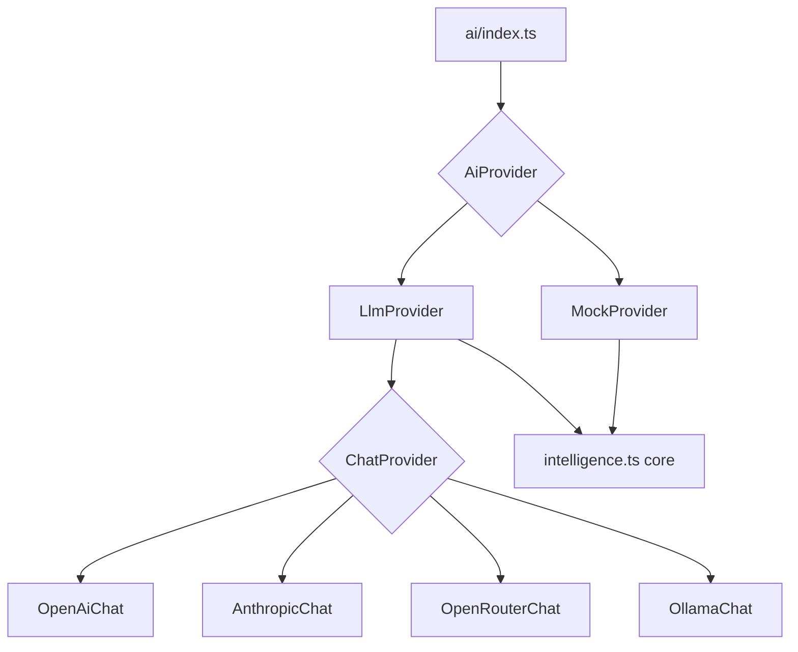
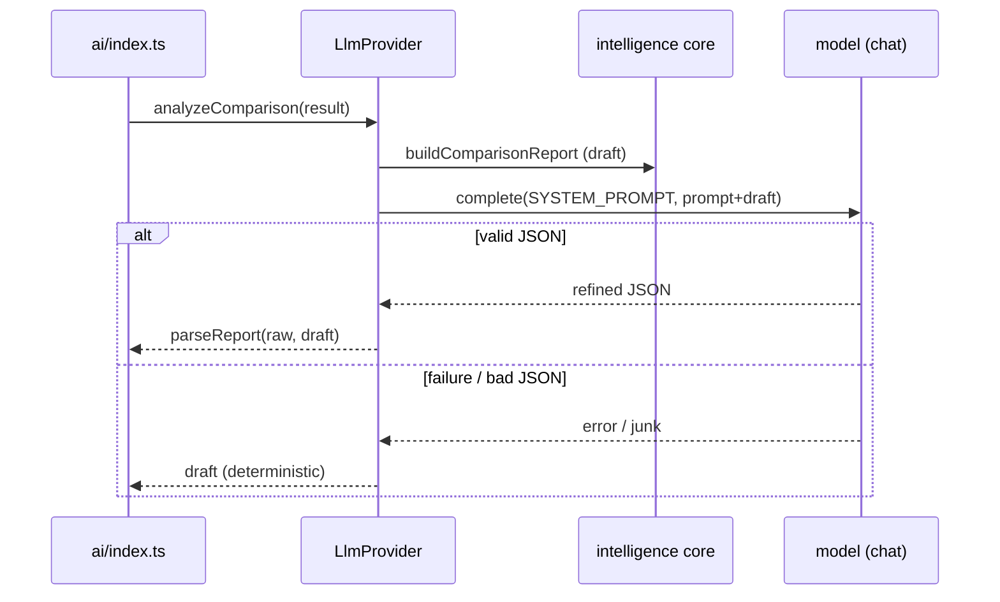

# AI providers

The AI layer is a pluggable provider abstraction over the deterministic intelligence core. Five providers are interchangeable — `openai`, `anthropic`, `openrouter`, `ollama` (local), and `mock` (offline) — plus an `auto` mode that picks the first configured one. Every entry point falls back to the deterministic engine so analysis never blocks. See [Regression intelligence agent](regression-intelligence-agent.md) for what the reports contain.

## Purpose

Let the same structured analysis be produced offline (deterministically), refined by a cloud LLM, or refined by a local model — chosen at runtime via config or the Settings tab — without any caller knowing which provider is active.

## The interfaces

`server/src/ai/provider.ts` defines two interfaces:

- **`AiProvider`** — `analyzeRun`, `analyzeComparison`, `analyzePortfolio`, and `test`. Every provider implements this.
- **`ChatProvider`** — a single `complete(system, user)` method. LLM backends implement this and are wrapped by `LlmProvider`.

## The providers

| Provider | Backend | Key required | Notes |
| --- | --- | --- | --- |
| `mock` | deterministic core | no | Returns `buildRunReport`/`buildComparisonReport`/`buildPortfolioReport` verbatim |
| `openai` | `https://api.openai.com/v1/chat/completions` | yes | Default model `gpt-4o-mini` |
| `anthropic` | `https://api.anthropic.com/v1/messages` | yes | Default model `claude-3-5-haiku-latest` |
| `openrouter` | `https://openrouter.ai/api/v1/chat/completions` | yes | OpenAI-compatible; default `openai/gpt-4o-mini` |
| `ollama` | `${OLLAMA_BASE_URL}/api/chat` | no | Local server; default `http://localhost:11434`, model `llama3.1` |

All chat backends call with `temperature: 0.2` for stable output. The Ollama backend uses no key, which is what makes air-gapped LLM analysis possible.

## Grounded refinement

`LlmProvider` (`server/src/ai/llm.ts`) never asks the model to analyze from scratch. For each request it:

1. Builds the **deterministic draft** via the intelligence core.
2. Sends `SYSTEM_PROMPT` + a user prompt that embeds the draft and the raw facts (`server/src/ai/prompts.ts`).
3. Parses the model's JSON onto the draft (`parseReport` / `parsePortfolioReport`).
4. On any parse failure, **returns the draft unchanged**.

The prompts forbid inventing numbers and require the verdict and numeric facts to stay consistent with the draft; the model may only sharpen wording, merge/re-rank hypotheses, and improve validation steps.

## Resolution, fallback, and runtime config

`server/src/ai/index.ts` resolves the provider **on every call** (`resolveProvider`) so a Settings change takes effect without a restart. The `auto` mode prefers OpenAI, then Anthropic, then OpenRouter (when keys are present), else `mock`. Each public function (`analyzeRun`/`analyzeComparison`/`analyzePortfolio`) wraps the call in try/catch and falls back to the mock tagged `"mock (fallback)"` if the live provider throws.

Configuration lives in `server/src/ai/config.ts`:

- Initial values come from env (`AI_PROVIDER`, `OPENAI_API_KEY`, `OPENAI_MODEL`, etc.).
- `updateConfig` applies runtime patches from the Settings tab; passing `null` for a key clears it, `undefined` leaves it unchanged.
- `getPublicConfig` returns a **masked** view: keys are never sent to the client, only a boolean "set" flag, a preview like `sk-••••abcd`, and a source of `env` / `runtime` / `none`.
- `resolveActiveProviderName` mirrors `resolveProvider`'s logic so the UI can show which provider will actually run.

See [Configuration](../reference/configuration.md) for every variable and the [Settings API](../api/index.md).

## How it is consumed

- **Server routes** call `analyzeRun` / `analyzeComparison` / `analyzePortfolio` and the `testConnection` helper.
- **Web** drives it through `web/src/pages/SettingsPage.tsx` (provider selection, keys/models, test connection) and renders the resulting reports.

## Entry points for modification

- **Add a provider:** implement a `ChatProvider`, add a `make…` factory in `server/src/ai/llm.ts`, wire it into `resolveProvider`/`resolveActiveProviderName` (`index.ts`/`config.ts`), add it to `ProviderChoice` and `VALID_PROVIDERS`, and add a tile in `SettingsPage.tsx`.
- **Change the prompt contract:** edit `server/src/ai/prompts.ts` (system prompt, schema, parsers).
- **Change fallback behavior:** edit the try/catch wrappers in `server/src/ai/index.ts`.
