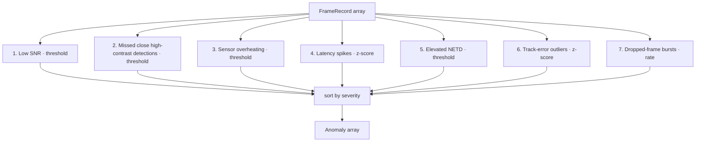

# Anomaly detection

`detectAnomalies` (`server/src/analysis/anomalies.ts`) scans a run's frames and flags issues as `Anomaly` records with a severity of `critical`, `warning`, or `info`. It mixes fixed domain thresholds with statistical (z-score) outlier detection. It runs once per run as part of `analyzeRun` and the results are cached.

## Purpose

Surface the specific frames and physical conditions that explain a run's quality before any comparison or AI narrative happens. Anomalies feed both the run detail view and the deterministic intelligence engine (anomaly severities drive verdict and confidence).

## The thresholds

A single `THRESHOLDS` object centralizes the domain limits:

| Threshold | Value | Meaning |
| --- | --- | --- |
| `lowSnrDb` / `criticalSnrDb` | 6 / 3 dB | reliable-detection floor / critical floor |
| `sensorOverheatC` / `sensorCriticalC` | 65 / 75 °C | sensor core temperature ceilings |
| `shortRangeM` | 800 m | range under which a high-contrast target should be detected |
| `strongContrastC` | 2.0 °C | contrast above which detection is expected |
| `highNetdMk` | 50 mK | elevated noise floor |
| `latencyZScore` / `trackErrorZScore` | 3σ | spike/outlier sensitivity |

## The seven detectors



1. **Low SNR** (`Signal Quality`) — frames below 6 dB; `critical` if any below 3 dB, else `warning`. Reports worst observed SNR.
2. **Missed detections on close high-contrast targets** (`Detection`) — always `critical`. A target within 800 m with ΔT ≥ 2 °C and no detection is a high-confidence false negative.
3. **Sensor overheating** (`Thermal/Hardware`) — frames ≥ 65 °C; `critical` if peak ≥ 75 °C, else `warning`.
4. **Classification latency spikes** (`Latency`) — `warning`. Frames more than 3σ above mean latency (only when σ > 0).
5. **Elevated NETD** (`Signal Quality`) — `warning`. Frames above 50 mK noise floor.
6. **Tracking-error outliers** (`Tracking`) — `warning`. Frames more than 3σ above mean track error.
7. **Dropped-frame bursts** (`Pipeline`) — `critical` if drop rate > 5%, else `info`.

## Anatomy of an anomaly

Each detector pushes an `Anomaly` (see [Data models](../reference/data-models.md)):

```ts
{
  id, category, severity,
  title, description,          // human-readable, with the numbers inlined
  metric,                      // the RunSummary/FrameRecord field implicated
  frameIds,                    // up to 50 offending frame ids
  affectedCount,               // total offending frames
  observedValue, threshold,    // worst value vs the limit it crossed
}
```

Anomalies are returned sorted by severity (`critical` → `warning` → `info`). The `nextId()` counter is module-level, so ids are unique within a process run.

## How it is consumed

- **Web:** `web/src/components/AnomalyList.tsx` renders each anomaly with its severity color (from the CSS tokens) on the run detail page.
- **Intelligence:** the deterministic engine counts critical/warning anomalies to set the run verdict and confidence, and uses them as evidence in root-cause hypotheses. See [Regression intelligence agent](regression-intelligence-agent.md).

## Statistical vs threshold detection

Threshold detectors (1, 2, 3, 5, 7) compare against fixed physical limits and are stable across runs. Statistical detectors (4, 6) use `mean`/`stddev` from `server/src/analysis/stats.ts` and are relative to each run, so they only fire when σ > 0 and a frame is a genuine outlier within that run.

## Entry points for modification

- Tune sensitivity by editing `THRESHOLDS`.
- Add a detector by pushing another `Anomaly` inside `detectAnomalies` and (if it implicates a new field) extending `FrameRecord`/`RunSummary`.
- Changing severity semantics may shift verdicts — review `server/src/ai/intelligence.ts`, which keys off anomaly severities.
