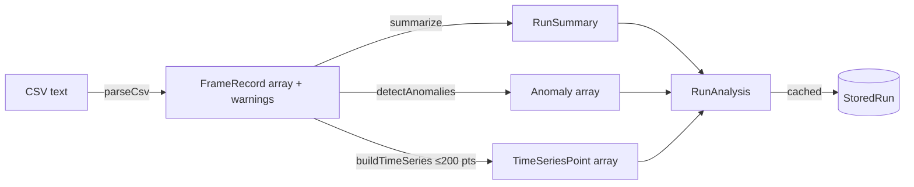

# CSV ingestion and analysis

This is the entry point of the domain pipeline: raw CSV text becomes a typed list of frames, then a `RunAnalysis` containing a summary, anomalies, and a downsampled time series. It runs once when a run is created and the result is cached on the `StoredRun`.

## Purpose

Accept real-world thermal test logs (which vary in column naming and ordering) without breaking, normalize them into `FrameRecord`s, and compute the aggregate metrics the rest of the app reasons about.

## Parsing

`parseCsv` (`server/src/parser.ts`) uses `csv-parse/sync` with `relax_column_count` and builds a column map from header aliases. Each canonical field has a list of accepted header names:

```ts
const ALIASES: Record<keyof FrameRecord, string[]> = {
  snrDb: ["snr_db", "snr"],
  deltaTC: ["delta_t_c", "delta_t", "thermal_contrast_c", "dt_c"],
  // ...17 fields total
};
```

Key behaviors:

- **Header normalization** — headers are lowercased and whitespace-collapsed before matching (`normalizeHeader`).
- **Missing columns warn, not throw** — required-ish columns (`snrDb`, `detectionConfidence`, `detected`) that are absent produce a warning and default to `0`/`false`. The warnings flow back to the client.
- **Type coercion** — `toNum` defaults non-numeric/blank cells to a fallback; `toBool` accepts `1/true/yes/y`.
- **Timestamp normalization** — values that look like seconds (`< 1e11`) are multiplied to milliseconds so duration math is consistent.
- **Derived contrast** — if `delta_t_c` is absent, `deltaTC` is computed as `targetTempC - ambientTempC`.
- **Hard errors** — only truly empty input or headers-without-rows throw.

The result is `{ frames: FrameRecord[]; warnings: string[] }`. See the `FrameRecord` shape in [Data models](../reference/data-models.md).

## Summarization

`analyzeRun` (`server/src/analysis/analyze.ts`) calls `summarize()` to build a `RunSummary` of ~15 metrics:

| Metric | Computation |
| --- | --- |
| `detectionRate`, `classificationRate`, `droppedFrameRate` | fraction of frames with the flag set (stored 0..1) |
| `meanSnrDb`, `meanDeltaTC`, `meanNetdMk`, `meanConfidence` | `mean()` over the field |
| `meanLatencyMs`, `p95LatencyMs` | mean and 95th percentile of classification latency |
| `meanTrackErrorM` | mean tracking error |
| `maxSensorTempC` | peak sensor temperature |
| `meanFrameRateHz` | mean frame rate |
| `durationS` | `(maxTimestamp - minTimestamp) / 1000` |
| `totalFrames`, `uniqueTargets` | counts |

All values pass through `round()` (`server/src/analysis/stats.ts`) for stable output. The stats module provides `mean`, `stddev` (sample variance, n-1), `percentile` (nearest-rank), and `round`.

## Time series

`buildTimeSeries()` downsamples frames to at most 200 evenly-spaced points for charting, keeping `snrDb`, `deltaTC`, `detectionConfidence`, `sensorTempC`, and `classificationLatencyMs` per point with `t` in seconds from start. This feeds `TimeSeriesCharts` on the web side.

## How it fits together



`RunStore.create` (`server/src/store.ts`) drives this: it parses, analyzes, stores the run, and auto-seeds the baseline if none exists.

## Sample data

`server/scripts/generate-samples.mjs` writes 12 reproducible CSVs using a seeded PRNG (`mulberry32`) and tunable scenario knobs. A shared `BASELINE` knob set is overridden per scenario:

| File | Profile |
| --- | --- |
| `run-a-baseline.csv` | healthy reference |
| `run-b-candidate.csv` | regressed (soak, SNR drop, latency spikes, drops, false negatives) |
| `run-c-improved.csv`, `run-d-improved-marginal.csv`, `run-e-improved-cool.csv` | improved / promotable |
| `run-f-sensor-overheat.csv` | thermal soak |
| `run-g-snr-dropout.csv` | mid-run SNR dropout |
| `run-h-latency-spikes.csv` | latency spikes |
| `run-i-dropped-frames.csv` | dropped-frame bursts |
| `run-j-close-range-fn.csv` | close-range false negatives |
| `run-k-mixed-critical.csv` | multiple critical failures |
| `run-l-long-duration.csv` | long run (3,600 frames) |

The generator models physical coupling: higher `soakRate` raises sensor temperature, which raises NETD and lowers SNR, which lowers detection probability. This makes the downstream anomalies and comparisons realistic.

## Integration points

- **Called by** `RunStore.create` (`server/src/store.ts`) on every upload.
- **Consumed by** [Anomaly detection](anomaly-detection.md) and [Run comparison](run-comparison-and-baseline-promotion.md), which operate on `RunSummary`/`Anomaly` data, not raw frames.
- **Surfaced by** `web/src/components/MetricGrid.tsx` and `TimeSeriesCharts.tsx`.

## Entry points for modification

- Add a CSV column: extend `ALIASES` and `FrameRecord` in `server/src/parser.ts` / `server/src/types.ts`, then populate it in the frame-building loop.
- Add a summary metric: extend `summarize()` and `RunSummary`, and decide whether it should be compared (add to `METRICS` in `compare.ts`) and detected (add a check in `anomalies.ts`).
