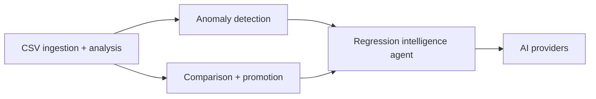

# Features

The cross-cutting capabilities of the analyzer. These span the server's domain and AI layers (and surface in the web app), so they are documented by capability rather than by directory. The [Server](../apps/server.md) and [Web](../apps/web.md) pages cover structure; these pages cover the algorithms and behavior.

| Feature | What it does | Primary code |
| --- | --- | --- |
| [CSV ingestion and analysis](csv-ingestion-and-analysis.md) | Parse tolerant CSVs into frames and compute run summaries + time series | `server/src/parser.ts`, `server/src/analysis/analyze.ts`, `server/src/analysis/stats.ts` |
| [Anomaly detection](anomaly-detection.md) | Flag issues with domain thresholds and statistical outlier checks | `server/src/analysis/anomalies.ts` |
| [Run comparison and baseline promotion](run-comparison-and-baseline-promotion.md) | Compare candidate vs baseline, rank runs, gate promotion | `server/src/analysis/compare.ts`, `server/src/store.ts` |
| [Regression intelligence agent](regression-intelligence-agent.md) | Turn analysis into verdicts, hypotheses, and validation steps (SRIA) | `server/src/ai/intelligence.ts` |
| [AI providers](ai-providers.md) | Pluggable LLM/offline providers with grounding and fallback | `server/src/ai/provider.ts`, `llm.ts`, `mock.ts`, `config.ts`, `index.ts` |

Reading order for newcomers: start with ingestion (how data becomes a run), then anomaly detection and comparison (what the app concludes deterministically), then the intelligence agent and providers (how those conclusions become a narrative report).
