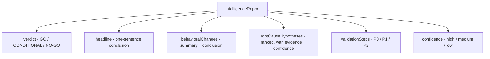
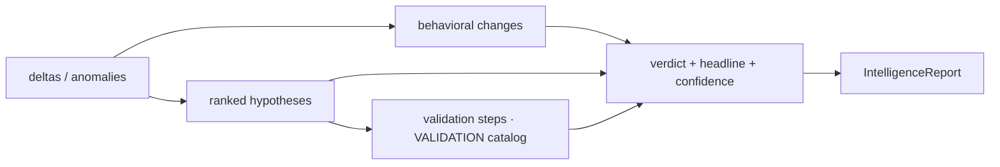

# Regression intelligence agent (SRIA)

The Simulation Regression Intelligence Agent turns analysis data into an engineering decision. Its heart is a **deterministic intelligence core** (`server/src/ai/intelligence.ts`) that produces a structured `IntelligenceReport`: a verdict, behavioral changes with actionable conclusions, ranked root-cause hypotheses, and prioritized validation steps. An optional LLM refines the narrative but never invents numbers. See [AI providers](ai-providers.md) for the provider plumbing.

## Purpose

Replace "here are the numbers" with "here is what changed, why it probably changed, what to do about it, and whether to ship." Because the core is deterministic, every verdict is reproducible and works offline.

## What a report contains

There are three report shapes (the `kind` field): `run` (single run), `comparison` (candidate vs baseline), and `portfolio` (compare-all). See [Data models](../reference/data-models.md).

## The deterministic core

`server/src/ai/intelligence.ts` exposes three builders:

| Builder | Input | Output |
| --- | --- | --- |
| `buildRunReport(name, analysis)` | a single `RunAnalysis` | `IntelligenceReport` (kind `run`) |
| `buildComparisonReport(comparison)` | a `ComparisonResult` | `IntelligenceReport` (kind `comparison`) |
| `buildPortfolioReport(baselineName, comparisons)` | many `ComparisonResult`s | `PortfolioReport` |

### Verdict logic

- **Run:** `NO-GO` if any critical anomaly, `CONDITIONAL` if any warning, else `GO`.
- **Comparison:** `NO-GO` if any critical regression, `CONDITIONAL` if any (non-critical) regression, else `GO`.
- **Portfolio:** `GO` if at least one regression-free promotable run exists (recommends the strongest), else `NO-GO`.

### Behavioral changes

For comparisons, `deltaToChange` turns each `MetricDelta` into a `BehavioralChange` using a per-metric knowledge catalog, `METRIC_NARRATIVE`. Each entry encodes the implication of an improvement/regression, the related metrics to check for cross-effects, and what to keep monitoring. The result is a `summary` plus a multi-sentence `conclusion` ending in a concrete "Recommended action: …". Changes are filtered by a `NOISE_FLOOR_PCT` of 3% (improvements smaller than that are dropped as noise) and sorted by severity then magnitude. For single runs, `anomalyToChange` builds the same shape from each critical/warning anomaly.

### Root-cause hypotheses

`comparisonHypotheses` / `runHypotheses` apply domain heuristics that capture real physical coupling, for example:

- **Thermal soak** — sensor temperature rose while NETD/SNR degraded → "a hotter focal plane lifts the noise floor."
- **Signal quality independent of soak** — SNR/NETD regressed without a temperature rise → optics contamination or calibration drift.
- **Detection regression with vs without an upstream cause** — distinguishes "downstream of reduced signal quality" from "a model/threshold change."
- **Latency from throttling vs compute contention** — keyed on whether sensor temperature also rose.
- **Pipeline instability**, **tracking degradation**, **reduced contrast** (often environmental).

Each hypothesis carries a `confidence` (derived by `confidenceFrom` over anomaly severities: a critical or two warnings → `high`), supporting `evidence` strings, and `relatedMetrics`. Hypotheses are sorted highest-confidence first.

### Validation steps

`stepsForHypotheses` maps each hypothesis title to a canonical remediation from the `VALIDATION` catalog (soak, noiseFloor, detection, contrast, latency, drops, tracking), de-duplicated and prioritized by the hypothesis confidence (`high → P0`, `medium → P1`, `low → P2`). A `GO` + promotable comparison prepends a "Promote as the new baseline" step.

## Portfolio report

`buildPortfolioReport` ranks every run by `overallImprovementPct`, lists promotable runs, recommends the strongest regression-free candidate as the next baseline, and aggregates root-cause titles across all regressing comparisons into `commonFailureModes` (which run is affected by which mode). It emits portfolio-level validation steps led by a P0 promote-and-re-run action.

## LLM refinement (optional)

When a live provider is configured, the deterministic draft is sent to the model as grounding (`server/src/ai/prompts.ts`). The system prompt casts the model as the SRIA and forbids inventing numbers; the schema requires it to keep verdicts and numeric facts consistent with the draft while sharpening wording, merging/re-ranking hypotheses, and improving validation steps. If the model fails or returns invalid JSON, the system falls back to the deterministic draft. See [AI providers](ai-providers.md).

## How it is consumed

- **Server:** `server/src/ai/index.ts` wraps the builders behind `analyzeRun` / `analyzeComparison` / `analyzePortfolio`, applies the active provider, and caches per-run reports via `store.setReport`.
- **Web:** `web/src/components/IntelligenceReportPanel.tsx` renders run/comparison reports (verdict banner, behavioral changes with conclusions, hypotheses with evidence, prioritized steps); `PortfolioReportPanel.tsx` renders the portfolio leaderboard and failure modes.

## Entry points for modification

- Add per-metric narrative: extend `METRIC_NARRATIVE`.
- Add a hypothesis: add a heuristic branch in `comparisonHypotheses`/`runHypotheses` and a matching `VALIDATION` entry + `validationKeyForTitle` mapping.
- Change verdict strictness: edit `comparisonVerdict` / the run-report severity gates.
- Change what the LLM may alter: edit the schema and rules in `server/src/ai/prompts.ts`.
