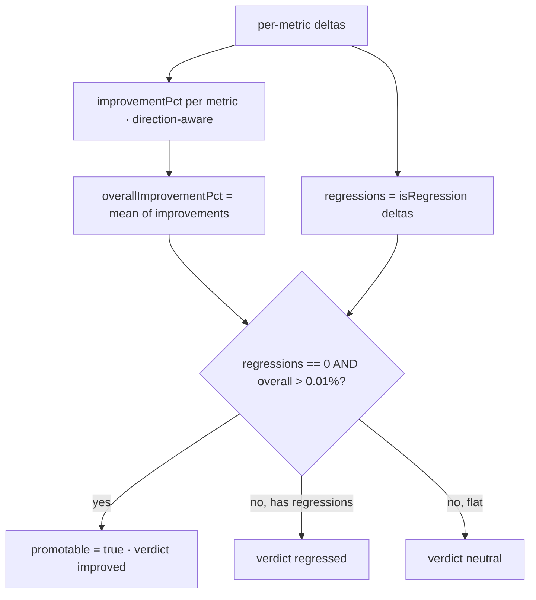

# Run comparison and baseline promotion

This feature answers "is this candidate better than our reference?" It compares a candidate run against the locked baseline metric by metric (`server/src/analysis/compare.ts`), computes an overall improvement, decides whether the candidate is promotable, and manages the baseline state (`server/src/store.ts`).

## Purpose

Provide a defensible, deterministic promotion decision: a candidate becomes the new baseline only when it has zero regressions and a genuinely positive aggregate improvement. The same machinery powers pairwise comparison, "compare all," and the portfolio report.

## The metric specification

`compareRuns` walks a fixed `METRICS` list. Each entry declares its preferred direction and the percent-delta magnitudes that count as a regression:

| Metric | Higher is better | warn % / crit % |
| --- | --- | --- |
| Detection Rate | yes | 2 / 5 |
| Classification Rate | yes | 2 / 5 |
| Mean Confidence | yes | 3 / 8 |
| Mean SNR | yes | 5 / 12 |
| Mean Thermal Contrast | yes | 5 / 15 |
| Mean NETD | no | 8 / 20 |
| Mean Latency | no | 10 / 25 |
| P95 Latency | no | 10 / 25 |
| Mean Track Error | no | 10 / 25 |
| Dropped Frame Rate | no | 20 / 50 |
| Max Sensor Temp | no | 5 / 12 |
| Mean Frame Rate | yes | 5 / 12 |

Rate metrics (detection, classification, dropped) are stored 0..1 and scaled to percentages for comparison via `PERCENT_KEYS`.

## Building a delta

`buildDelta` computes, per metric, a `MetricDelta` with `baseline`, `candidate`, `absoluteDelta`, `percentDelta`, `severity`, and `isRegression`:

```ts
const improved = spec.higherIsBetter ? abs > 0 : abs < 0;   // moved the right way?
const magnitude = Math.abs(pct);
// only a move AGAINST the preferred direction can be a regression
if (!improved && magnitude >= spec.critPct) severity = "critical";
else if (!improved && magnitude >= spec.warnPct) severity = "warning";
```

A `critical` or `warning` delta is an `isRegression`. An `info` move (against direction but below the warn threshold) is noted but does not block promotion.

## Overall improvement and the promotion gate



- `improvementPct(d)` flips the sign for "lower is better" metrics so positive always means "better."
- `overallImprovementPct` is the mean of those per-metric improvements.
- `promotable` is true only when there are **zero regressions** and `overallImprovementPct > PROMOTION_EPSILON` (0.01%).
- `overallVerdict` is `regressed` if any regression exists, else `improved` if above epsilon, else `neutral`.

## Baseline state

The baseline lives in the `RunStore` (`server/src/store.ts`):

- The **first uploaded run is auto-seeded** as the baseline.
- The baseline can be set explicitly (`POST /api/baseline`) and is tracked with a lock timestamp.
- Promotion (`POST /api/baseline/promote`) re-runs the comparison server-side and, unless overridden, refuses to promote a non-promotable candidate.
- Deleting the baseline run clears the baseline.

Because state is in memory, the baseline resets on server restart. See [Server](../apps/server.md).

## Compare-all and portfolio

`POST /api/compare/all` runs `compareRuns(baseline, candidate)` for every non-baseline run and returns them ranked by `overallImprovementPct`. The web `ComparePage` uses this to show a leaderboard and to suggest the best promotable candidate. Layering the intelligence agent on top produces a [portfolio report](regression-intelligence-agent.md) that ranks runs and surfaces shared failure modes.

## How it is consumed

- **Web:** `web/src/pages/ComparePage.tsx` renders the delta table (with per-metric severity coloring), the overall verdict, the promote button, and a manual-override path.
- **AI:** `compareComparison`-style intelligence reads the `ComparisonResult` (deltas, regressions, overall %) and never recomputes numbers — it explains them.

## Entry points for modification

- Add or retune a compared metric: edit the `METRICS` list (key, direction, warn/crit percentages). Note that one entry's key is rendered as a redaction in source views; preserve it verbatim when editing.
- Change promotion strictness: adjust `PROMOTION_EPSILON` or the `promotable` condition.
- Change ranking: the sort happens in the compare-all route in `server/src/index.ts`.
