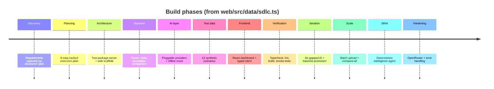

# Lore

How this project came to be. A note on sources: the git history is a single squashed `Initial commit` (2026-05-31), so the chronology below is reconstructed from the project's own recorded lifecycle in `web/src/data/sdlc.ts` (rendered by the in-app [Summary page](apps/web.md)) and the shape of the code. The app was built by Factory's Droid agent in twelve phases, captured faithfully by the team as it went.

## The arc

## Era 1 — Foundations (phases 1–8)

The project began by removing ambiguity: a short clarifying questionnaire fixed the interface (web, React/Node), the AI strategy (pluggable, with an offline fallback), and the data format (CSV thermal logs). From there a clean two-package monorepo was scaffolded with strict TypeScript and ESM, and a dev proxy tying the web app to the API.

The domain core came first and deliberately: a tolerant CSV parser, statistical helpers, threshold-plus-z-score anomaly detection, run summaries, and baseline-vs-candidate comparison — all deterministic and side-effect-free. The pluggable AI layer followed, designed from the start so that cloud LLMs and an offline deterministic mock were interchangeable with automatic fallback. Twelve reproducible sample logs were generated to exercise every code path, then the React dashboard was built over the pipeline. The era closed on a verification discipline that survives today: typecheck + lint on both packages, a production web build, and live HTTP smoke tests.

## Era 2 — Going offline and gating quality (phases 9–10)

The app grew up for serious use. A local **Ollama** provider made full AI analysis possible air-gapped. An overall improvement score and a **locked baseline with promotion rules** turned "here are deltas" into a gated decision: a candidate is promoted only when it has zero regressions and a positive aggregate improvement. Runtime key management arrived so providers could be switched without a restart. The data set scaled to twelve scenarios, and **batch upload** plus a one-shot **compare-all** brought whole-portfolio analysis into a single action — along with the "stay on the Runs tab until you have two runs" upload UX.

## Era 3 — From summaries to intelligence (phases 11–12)

The defining shift: AI analysis became the **Simulation Regression Intelligence Agent**. A deterministic engine now produces the full structured report — verdict, behavioral changes with actionable conclusions, ranked root-cause hypotheses, prioritized validation steps — and an optional LLM only refines its narrative, grounded so it cannot invent numbers. Portfolio intelligence was routed through the same active provider. Finally the system was hardened: an **OpenRouter** provider (bringing the count to five), Multer upload error handling that returns clean JSON, settings-persistence fixes, and the self-documenting Summary tab that this lore page draws from.

## What the history tells you

- **Determinism was a first principle, not a retrofit.** The analysis core was built to be reproducible before any AI was added, which is why the SRIA can ground an LLM and still work offline.
- **Each AI capability shipped with a fallback.** Offline mock, then Ollama, then graceful degradation on provider failure — availability never depended on a cloud key.
- **Decisions, not dashboards.** The throughline from anomaly detection → comparison → promotion gating → GO/NO-GO verdicts is the product's real spine.

See [Architecture](overview/architecture.md) for how these layers fit together today and [Fun facts](fun-facts.md) for the quirks left behind along the way.
