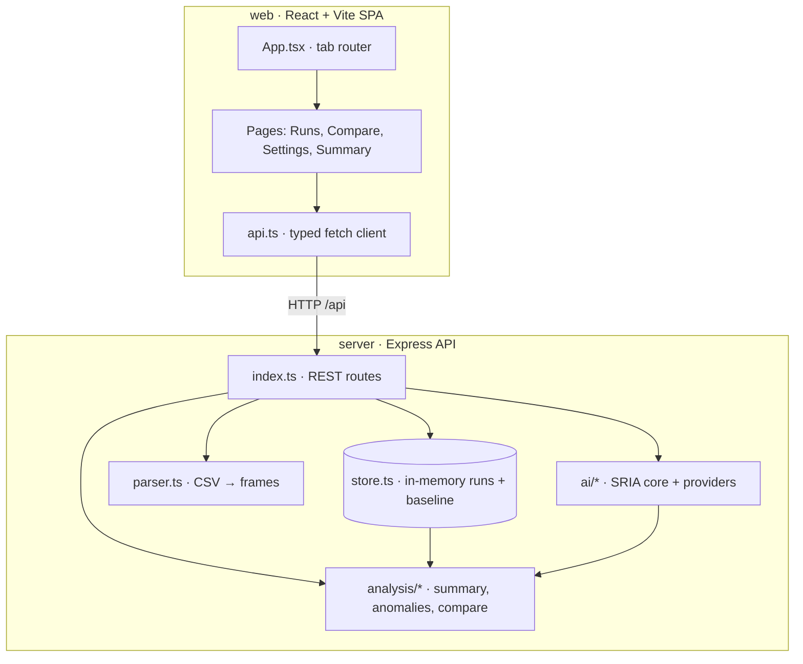
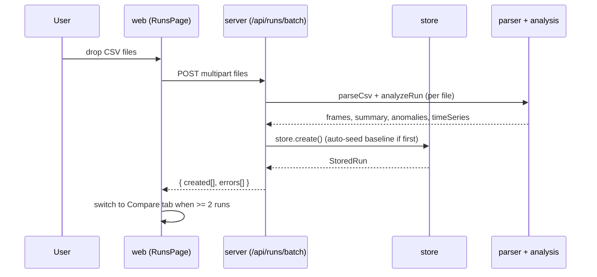
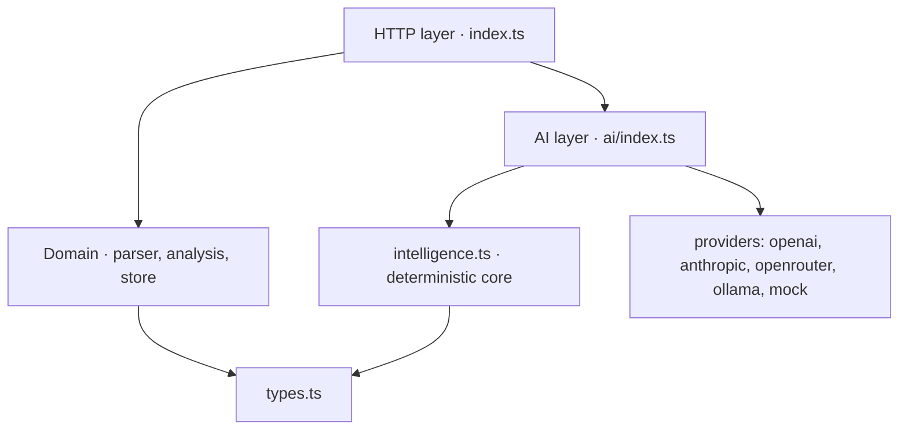
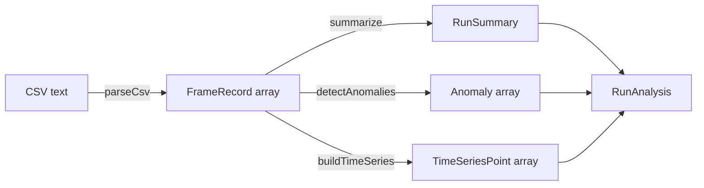
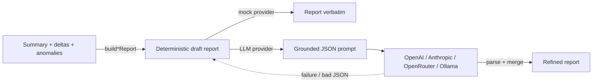

# Architecture

The system is a two-tier monorepo: a React single-page app talks to an Express REST API over `/api`. All domain logic lives in the server; the web app is a typed client and visualization layer. There is no database — runs and baseline state are kept in an in-memory store that resets when the server restarts.

## Components

The Vite dev server proxies `/api` to `http://localhost:4000` (`web/vite.config.ts`), so the two apps run as one origin in development.

## Request lifecycle: uploading and analyzing a run

## Backend layering

The server has three clean layers, each importing only downward:

1. **HTTP layer** — `server/src/index.ts`. Express routes, Multer file upload, JSON error middleware, and the settings endpoints. It is the only layer that knows about HTTP.
2. **Domain layer** — `server/src/parser.ts`, `server/src/analysis/*`, `server/src/store.ts`. Pure functions plus a stateful store. No HTTP or AI knowledge in the analysis functions.
3. **AI layer** — `server/src/ai/*`. A provider abstraction over a deterministic "intelligence core". The core grounds optional LLM refinement and is the default offline engine.

See [Server](../apps/server.md) for the full module map and [AI providers](../features/ai-providers.md) for how the provider abstraction and fallback work.

## Data flow through analysis

A run flows through a fixed pipeline once on creation, and the results are cached on the `StoredRun`:

The comparison and intelligence layers operate on the cached `RunSummary` and `Anomaly` data, never re-reading raw frames. See [CSV ingestion and analysis](../features/csv-ingestion-and-analysis.md).

## AI grounding model

The defining architectural decision: a deterministic engine produces the full structured report first, and an optional LLM only refines its narrative.

This means every verdict is reproducible and works offline; the LLM is a presentation enhancer, not the source of truth. See [Regression intelligence agent](../features/regression-intelligence-agent.md).

## Technology choices

- **Language breakdown** (source only, approximate): server TypeScript ~2,570 lines, web TypeScript/TSX ~3,030 lines.
- **Server:** Express 4, Multer (uploads), csv-parse, dotenv. No ORM, no DB.
- **Web:** React 18, Vite 5, Recharts (charts). Inline-style design system driven by CSS variables in `web/src/styles.css`.
- **Tooling:** ESLint 9 flat config, jscpd (duplicate detection), tsx (dev runner), `tsc` strict typecheck.

See [Dependencies](../reference/dependencies.md) for the full list and [By the numbers](../by-the-numbers.md) for size and complexity stats.
