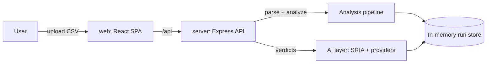

# Thermal Test Analyzer

Thermal Test Analyzer is an AI-assisted tool for analyzing thermal imaging effectiveness test logs. It ingests CSV telemetry from sensor test runs, computes per-run summaries, detects anomalies, compares runs against a locked baseline, and produces a structured engineering verdict (GO / CONDITIONAL / NO-GO) through a Simulation Regression Intelligence Agent.

## What it does

A thermal imaging sensor system is exercised in field/simulation tests that emit per-frame telemetry: signal-to-noise ratio, thermal contrast, detection/classification flags, latency, tracking error, sensor temperature, and more. This tool turns that raw telemetry into decisions:

- **Parse** tolerant CSV logs into typed frame records (`server/src/parser.ts`).
- **Summarize** each run into ~15 aggregate metrics (`server/src/analysis/analyze.ts`).
- **Detect anomalies** with domain thresholds and statistical outlier checks (`server/src/analysis/anomalies.ts`).
- **Compare** a candidate run against a baseline, metric by metric, and decide whether it is promotable (`server/src/analysis/compare.ts`).
- **Promote** the best run to be the new locked baseline, gated on zero regressions and a positive aggregate improvement (`server/src/store.ts`, `server/src/index.ts`).
- **Reason** about results with the Simulation Regression Intelligence Agent (SRIA): a deterministic engine that emits verdicts, ranked root-cause hypotheses, and prioritized validation steps, optionally refined by an LLM (`server/src/ai/intelligence.ts`).

## Who uses it

Test engineers and analysts who need to decide whether a new sensor build or configuration is better than the current reference. The app runs fully offline (including AI analysis via a deterministic engine or a local Ollama server), which suits air-gapped environments.

## Shape of the repository

A small npm monorepo with two applications:

- **`server/`** — Express + TypeScript REST API. Parsing, analysis, comparison, baseline state, and the AI layer. See [Server](../apps/server.md).
- **`web/`** — React + Vite single-page dashboard. Upload, run detail, comparison, settings, and an SDLC summary view. See [Web](../apps/web.md).

## Quick links

- [Architecture](architecture.md) — components and data flow
- [Getting started](getting-started.md) — install, run, build
- [Glossary](glossary.md) — domain terms (SNR, NETD, ΔT, SRIA, baseline promotion)
- [Features](../features/index.md) — the analysis, comparison, and intelligence capabilities
- [API reference](../api/index.md) — every REST endpoint
- [Data models](../reference/data-models.md) — the core types

## Key facts

- **Language:** TypeScript (ESM) across both apps, strict mode on.
- **State:** runs and baseline are held in memory; they reset on server restart.
- **AI providers:** five interchangeable options — `openai`, `anthropic`, `openrouter`, `ollama` (local), and a deterministic `mock`, with automatic fallback so analysis never blocks.
- **Offline-first:** the entire analysis core makes no external calls; AI analysis works air-gapped via the mock engine or a local Ollama model.
