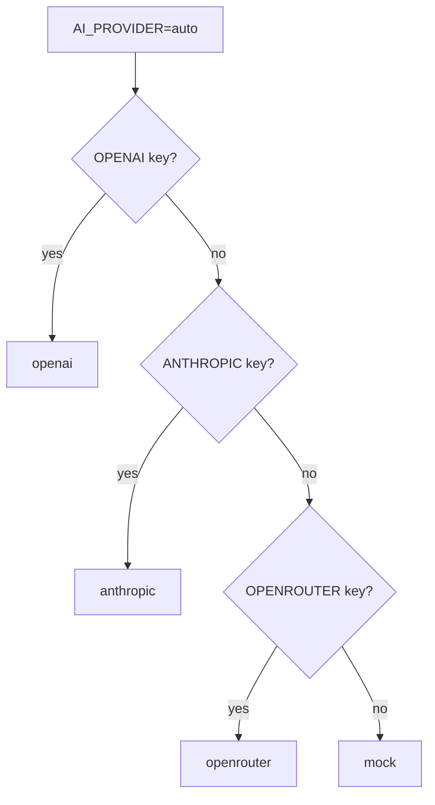

# Configuration

The server is configured by environment variables (loaded from `.env` via `dotenv`) and by runtime overrides from the **Settings** tab. Runtime overrides take precedence and are held in memory until the server restarts. Defaults are defined in `server/src/ai/config.ts`.

## Environment variables

| Variable | Default | Purpose |
| --- | --- | --- |
| `PORT` | `4000` | API listen port (`server/src/index.ts`) |
| `AI_PROVIDER` | `auto` | Provider mode: `auto`, `openai`, `anthropic`, `openrouter`, `ollama`, `mock` |
| `OPENAI_API_KEY` | — | OpenAI key (enables `openai`) |
| `OPENAI_MODEL` | `gpt-4o-mini` | OpenAI model |
| `ANTHROPIC_API_KEY` | — | Anthropic key (enables `anthropic`) |
| `ANTHROPIC_MODEL` | `claude-3-5-haiku-latest` | Anthropic model |
| `OPENROUTER_API_KEY` | — | OpenRouter key (enables `openrouter`) |
| `OPENROUTER_MODEL` | `openai/gpt-4o-mini` | OpenRouter model |
| `OLLAMA_BASE_URL` | `http://localhost:11434` | Local Ollama server base URL |
| `OLLAMA_MODEL` | `llama3.1` | Ollama model name |

`.env.example` documents these without values; `.env` is gitignored. An invalid `AI_PROVIDER` falls back to `auto`.

## Provider resolution (`auto` mode)

`auto` picks the first available backend, otherwise `mock`:

Explicit modes resolve directly: `mock` and `ollama` need no key; `openrouter`/`openai`/`anthropic` fall back to `mock` if their key is missing. This logic lives in `resolveProvider` (`server/src/ai/index.ts`) and is mirrored by `resolveActiveProviderName` (`server/src/ai/config.ts`) for display. See [AI providers](../features/ai-providers.md).

## Runtime settings (Settings tab)

`PUT /api/settings` applies a patch (`updateConfig`): provider, per-provider keys/models, and Ollama base URL/model. Keys passed as `null` are cleared; omitted fields are unchanged. `GET /api/settings` returns a masked view — key previews, "set" flags, and a `source` of `env` / `runtime` / `none` — never the raw key. `POST /api/settings/test` validates the active provider's credentials. See the [Settings API](../api/index.md) and [Security](../security.md).

## Web build configuration

- `web/vite.config.ts` — React plugin and the dev `/api` proxy to `http://localhost:4000`. Change the proxy target if the API runs elsewhere.
- `web/tsconfig.json` / `server/tsconfig.json` — strict ESM TypeScript; see [Tooling](../how-to-contribute/tooling.md).
