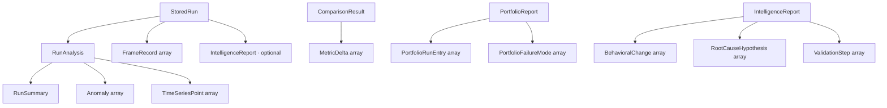

# Data models

The core domain types live in `server/src/types.ts` and are mirrored client-side in `web/src/api.ts`. This page is a reference for each type and how they relate.

## Relationships

## Ingestion types

### `FrameRecord`
One sampled frame (17 fields): `timestamp`, `frameId`, `targetId`, `rangeM`, `ambientTempC`, `targetTempC`, `deltaTC`, `snrDb`, `netdMk`, `detectionConfidence`, `detected`, `classified`, `classificationLatencyMs`, `trackErrorM`, `sensorTempC`, `frameRateHz`, `droppedFrame`. Produced by `parseCsv`.

### `RunSummary`
15 aggregate metrics: `totalFrames`, `durationS`, `detectionRate`, `classificationRate`, `droppedFrameRate`, `meanSnrDb`, `meanDeltaTC`, `meanNetdMk`, `meanConfidence`, `meanLatencyMs`, `p95LatencyMs`, `meanTrackErrorM`, `maxSensorTempC`, `meanFrameRateHz`, `uniqueTargets`. Rate fields are stored 0..1.

### `Anomaly`
A flagged issue: `id`, `category`, `severity` (`critical`/`warning`/`info`), `title`, `description`, `metric`, `frameIds[]`, `affectedCount`, `observedValue`, `threshold`. See [Anomaly detection](../features/anomaly-detection.md).

### `RunAnalysis`
`{ summary: RunSummary, anomalies: Anomaly[], timeSeries: TimeSeriesPoint[] }` — the cached analysis on each run.

### `TimeSeriesPoint`
A downsampled chart point: `t` (seconds from start), `snrDb`, `deltaTC`, `detectionConfidence`, `sensorTempC`, `classificationLatencyMs`.

### `StoredRun`
`{ id, name, createdAt, frames: FrameRecord[], analysis: RunAnalysis, aiReport?: IntelligenceReport }` — the in-store record.

## Comparison types

### `MetricDelta`
A per-metric comparison: `metric`, `label`, `baseline`, `candidate`, `absoluteDelta`, `percentDelta`, `isRegression`, `severity`, `unit`, `higherIsBetter`.

### `ComparisonResult`
`baselineId/Name`, `candidateId/Name`, `deltas[]`, `regressions[]`, `overallImprovementPct`, `improvedCount`, `regressedCount`, `overallVerdict` (`improved`/`neutral`/`regressed`), `promotable`. See [Run comparison and baseline promotion](../features/run-comparison-and-baseline-promotion.md).

### `BaselineState`
`{ runId, name, createdAt, lockedAt }` — the currently locked baseline.

## Intelligence types

### `IntelligenceReport`
`kind` (`run`/`comparison`), `subject`, `verdict` (`GO`/`CONDITIONAL`/`NO-GO`), `headline`, `behavioralChanges[]`, `rootCauseHypotheses[]`, `validationSteps[]`, `confidence` (`high`/`medium`/`low`), `generatedBy`.

### `BehavioralChange`
`metric`, `label`, `summary`, `conclusion` (actionable narrative: implication + cross-metric impact + recommended action), `direction` (`improved`/`regressed`/`neutral`), `severity`, `magnitudePct`.

### `RootCauseHypothesis`
`title`, `detail`, `confidence`, `evidence[]`, `relatedMetrics[]`.

### `ValidationStep`
`action`, `rationale`, `priority` (`P0`/`P1`/`P2`).

### `PortfolioReport`
`kind` (`portfolio`), `baselineName`, `runCount`, `verdict`, `headline`, `promotable[]`, `ranked: PortfolioRunEntry[]`, `commonFailureModes: PortfolioFailureMode[]`, `recommendedBaseline`, `validationSteps[]`, `generatedBy`.

- **`PortfolioRunEntry`** — `candidateId`, `candidateName`, `verdict`, `overallImprovementPct`, `promotable`, `topIssue`.
- **`PortfolioFailureMode`** — `mode`, `affectedRuns[]`, `confidence`.

See [Regression intelligence agent](../features/regression-intelligence-agent.md) for how these are produced.

## Client mirroring

`web/src/api.ts` re-declares these types for the frontend. They must be kept in sync with `server/src/types.ts` by hand — a divergence surfaces as a typecheck error. See [Cleanup opportunities](../cleanup-opportunities.md).
