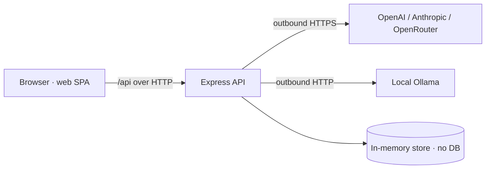

# Security

The app is a single-session analysis tool with a small attack surface, but it handles API keys and accepts file uploads. This page documents the trust boundaries and how secrets are handled.

## Trust boundaries

The server is the only place domain logic and secrets live. The browser never sees raw API keys. The only outbound traffic is to the configured AI provider — and none at all when using `mock`.

## Secret handling

API keys are treated as write-only from the client's perspective (`server/src/ai/config.ts`):

- Keys originate from environment variables (`OPENAI_API_KEY`, `ANTHROPIC_API_KEY`, `OPENROUTER_API_KEY`) or runtime Settings updates.
- `GET /api/settings` returns a **masked** view only: a boolean "set" flag, a preview like `sk-••••abcd` (`maskKey`), and a source (`env` / `runtime` / `none`). The raw key is never serialized to the client.
- Runtime keys live in process memory and are cleared by sending `null`; they vanish on restart.
- `.env` is gitignored; `.env.example` documents the variables without values.

This satisfies the readiness `secrets_management` criterion (keys via env, masked, gitignored) noted in `AGENT_READINESS_SUMMARY.txt`.

## File uploads

CSV uploads go through Multer with **memory storage** and a **50 MB per-file limit** (`server/src/index.ts`). Files are parsed in memory and never written to disk. The CSV parser is tolerant and does not execute or evaluate cell contents — values are coerced to numbers/booleans/strings only (`server/src/parser.ts`). Multer errors are converted to clean JSON (413/400) by the trailing error middleware.

## Known exposures and caveats

- **CORS is fully open** (`app.use(cors())`) — appropriate for local/dev use, but should be restricted before any shared deployment.
- **No authentication or authorization.** Anyone who can reach the API can upload runs, change AI settings (including keys), and trigger outbound LLM calls. This is acceptable for a local single-user tool, not for a multi-tenant deployment.
- **No rate limiting** on analysis or `compare/all/intel`, which can fan out many LLM calls.
- **Outbound calls** happen only for non-mock providers; the request bodies include run metrics and deltas (no raw frames) — review data-sensitivity before sending telemetry to a cloud provider. Use `ollama` or `mock` for sensitive/air-gapped data. See [AI providers](features/ai-providers.md).
- **No secret scanning, CODEOWNERS, or PR templates** are configured (readiness gaps).

## Recommendations before sharing

1. Restrict CORS to the known web origin.
2. Add authentication (even a single shared token) if exposed beyond localhost.
3. Add basic rate limiting on the intelligence endpoints.
4. Default `AI_PROVIDER` to `ollama` or `mock` for sensitive deployments.

See [Configuration](reference/configuration.md) for the variables involved and [Background](background.md) for the offline-first rationale.
